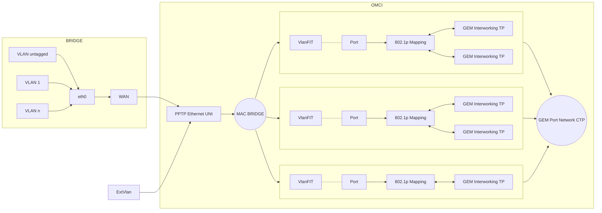
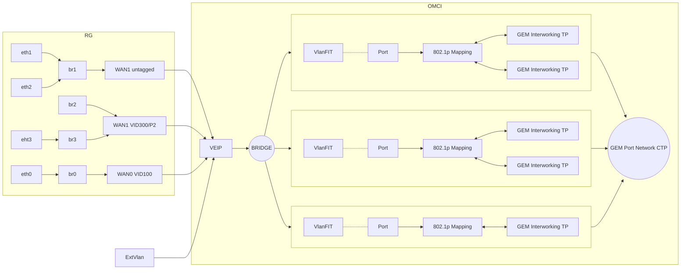

ONTs are the terminating elements of the PON network, and play, like the ONT an essential role in the PON architecture. The ONT converts the optical media into an electrical interface and takes care of authenticating, monitoring, processing as well as managing all matters related to the GPON tree. Often these devices are installed directly in the home[^hsgp_hg_sfu].

Three layers can be identified in the ONT: core layer, service layer and public layer.
- The core layer provides multiplexing and the optical interface;
- the service layer refers mainly to the user port;
- the public layer provides power and maintenance management[^hsgp_hg_sfu].

The ONT can connect to various terminal devices, such as set-top boxes, wireless routers, TVs, etc., and performs photoelectric conversion, maintenance and monitoring functions. According to the application, ONT can be divided into six types, namely[^hsgp_hg_sfu]:
- SFU (Single Family Unit) ONT
- HGU (Home Gateway Unit) ONT 
- MDU (Multi-Dwelling Unit) ONT 
- SBU (Single Business Unit) ONT 
- MTU (Multi-Tenant Unit) ONT
- CBU (Cellular Backhaul Unit) ONT

However, only SFU (Single Family Unit) ONT and HGU (Home Gateway Unit) ONT are used by the end-users in practical application.

HGU ONT, is a home gateway with an uplink interface of the PON, is designed for the single home unit. HGU ONT integrates the functions of ONT and RG to realize more complex control and management and provide Ethernet / IP service, VoIP service, routing mode (firewall and NAT), and optional CATV service. HGU ONT has an Ethernet interface and POTS interface, WLAN interface, USB interface, CATV RF interface are also available. The HGU is a Layer III device[^hsgp_hg_sfu].

The ONT SFU type can be understood as a simple Layer II device, like an L2 switch or media converter, have a single port and are exclusively optical-electric converters. That simply transparently transports traffic from the PON to the eth port(s) of the customer ONT. No routing or VoIP functionality is assumed for the SFU type. For SFU, a simple service configuration from the OLT station is used. The cost of SFU device is cheaper, because additional services (routing, telephony, TV) are not implemented.

Within the GPON OMCI standards we can find two types of interfaces, and they are relatively VEIP and PPTP. This virtual interface are the boundaries between the GPON/OMCI part and the non-GPON/Ethernet part[^G_984_4],[^G_988],[^hsgp_hg_sfu].

ONT will report VEIP or PPTP (Physical Path Termination Point) when MIB 11 oe 329 is uploaded according to the type of the device. Only one VEIP is allowed in a HGU and VEIP is not available for SFU devices. OLT determines the ONT type based on the ONT Type attribute in ME Capability.

# Physical Path Termination Point (PPTP/Ethernet UNI - MIB 11)

PPTP/EthUni, on the other hand, is designed for transparent L2 bridges, potentially N each with its own VLAN. OLT is responsible to provision of VLAN and LAN Port[^nanomad_fc],[^anime_rtl960x].

The SFU type ONT device is configured and controlled completely remotely from the OLT via the OMCI management interface. Generally these devices do not require special configurations and therefore access to the web interface of the client ONT device is not required, although it is possible to update the software. To configure the switching of the required VLANs, the Ethernet port profiles of the client ONT are created at the OLT. Most of user-side configurations must be made in the devices connected to the SFU.

For OMCI data flow, there is a mutually unambiguous mapping between the GEM port on the OLT side with the UNI Ethernet port on the terminal side of the ONT. All data packets can pass through without learning or forwarding the MAC address. The SFU ONT supports multiple VLAN function through bridge mode.

Source [^cablefax_future], [^G_988]

# Virtual Ethernet interface point (VEIP - MIB 329)

VEIP is a service profile designed to terminate the connection directly on the CPE, providing N services (voice, data, video) each with its own characteristics. Allows multiple Ethernet services to be carried over a single PON link. VEIP virtualises all interfaces of the ONU.

Similarly, all UNI-side modules within a VEIP are invisible to and cannot be managed by the OMCI or the user. They are only visible and manageable to a management domain other than OMCI. In addition, each ONT must have only one VEIP.

In some countries, it is also used to allow quick switches between ISPs, ISP A is assigned Ethernet port 1 of the HGU, ISP B is assigned Ethernet port 2 of the HGU, and so on[^nanomad_fc],[^anime_rtl960x],[^huawei_veip].

Source [^hsgp_hg_sfu]

---

[^G_988]: *G.988: ONU management and control interface (OMCI) specification* https://www.itu.int/rec/T-REC-G.988
[^G_984_4]: *G.984.4: Gigabit-capable Passive Optical Networks (G-PON): ONT management and control interface specification* https://www.itu.int/rec/T-REC-G.988
[^bbf_247_certification]: *BBF.247 Certification*  https://www.broadband-forum.org/wp-content/uploads/2020/12/BBF.247-GPON-ONU-Products-2020-12-21.pdf
[^hsgp_hg_sfu]: *Differences between HGU ONU and SFU ONU*  https://hsgq.com/optical-module/296.html
[^anime_rtl960x]: *Hacking RTL960x*  https://github.com/Anime4000/RTL960x
[^nanomad_fc]: *XGS-PON - ONT SFP+ su router proprietario*  https://forum.fibra.click/d/39131-xgs-pon-ont-sfp-su-router-proprietario/12
[^huawei_veip]: *VEIP knowledge*  https://forum.huawei.com/enterprise/en/veip-knowledge/thread/771975-100181
[^cablefax_future]: *PONs: Why Testing For Conformance And Interoperability Are Key To Their Future*  https://www.cablefax.com/archives/pons-why-testing-for-conformance-and-interoperability-are-key-to-their-future