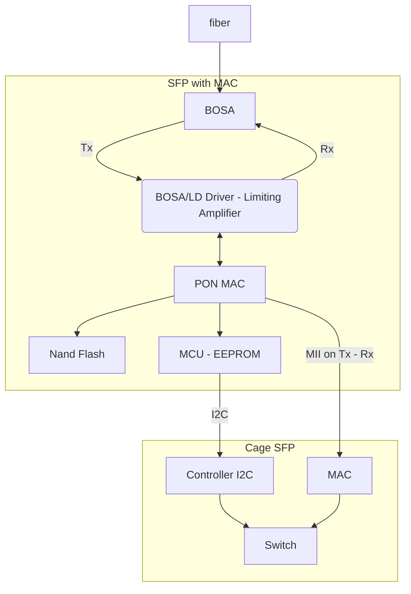
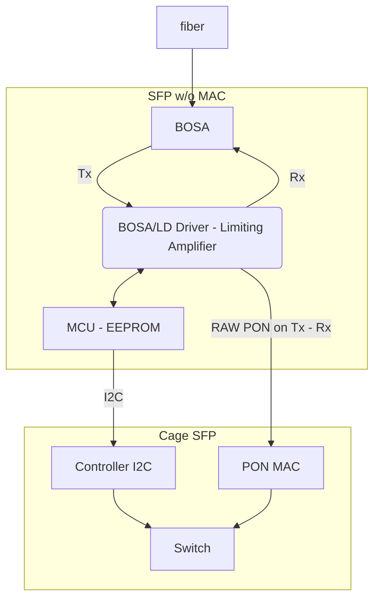

PON technologies, unlike Ethernet, are not P2P but one-to-many with two device types: ONU (Optical Network Unit)/ONT (Optical Network Terminal) and OLT (Optical Line Terminal). Both devices can be manufactured using the SFP form factor[^tibit].

The OLT provides an integrated access box for Passive Optical Networks. OLTs are typically chassis with one or more line cards inside, and on each line card there is one or more PON transceiver, usually in the SFP form factor. Each line card is connected to a secondary switch that provides line card aggregation to the Ethernet uplinks. OLTs are often a mixture of Layer 2 and Layer 3 switching with traffic shaping on a per-customer, per-service basis[^tibit].

The communication within the SFP PON transceiver is neither MII nor Ethernet, outside [SFP standards](/sfp-standard.md), but rather it is an *equivalent electrical symbols of optical transmission* (which is simply the input/output of the [BOSA](/bosa-tosa-rosa.md)) that for simplicity's sake we call **PON RAW communication** (also referred to as SFP w/o PON MAC). All the PON management part is left to the line card itself. Each equivalent electrical symbol of optical transmission is a separate dialect, distinct from other dialects. Furthermore, as one can easily guess, this communication is not standard and is not within the signalling standards ([^sfprate],[^sfprate2],[^sfpplusstandard]) but it is compliant with some portions of the MSA [^sfpstandard],[^sfpplusstandard],[^sfpplusmi]. This requires extreme compatibility between ONT and transceiver. This design choice is made for several reasons:
- *size*: the size of an OLT w/o PON MAC is very similar to that of an MII or Ethernet transceiver, and the size of an OLT with the integrated PON MAC far exceeds that of the standard SFP form factor;
- *dissipative heating capacity*: the dissipative heating capacity of an OLT with PON MAC is higher than a normal transceiver, such as a 1 or 10 Gbps Ethernet link;
- *duplication*: there is a double `MAC` → `MII` conversion (`MII` → `MAC` → `PHY` → `MAC` → `OLT CPU`);
- *repairability*: since lasers often have a shorter lifetime than other ICs, it is good to be able to only change the transceiver.

Despite this, there is a vendor that sells OLT SFPs with PON MAC[^tibit]. The following pictures show an OLT SFP with PON MAC part and a transreciver without PON MAC. It is interesting to see that the latter is much longer and requires an additional heatsink.




Similarly, the same argument can be made for ONT SFPs, especially in 10E-PON and XGS-PON there are a lot of transceivers w/o PON MAC and few ONTs with PON MAC. In this case, the reasons are similar to the OLT SFPs'. It is also clear that ONTs w/o PON MAC require a PON MAC part within the end device that supports the relevant communication protocol.

The following pictures show some operating diagrams of some ONT with PON MAC and ONT w/o PON MAC[^SFPP-XGS-ONU-MAC-ASC-I-C],[^SFPP-XGS-ONU-N1-I-C],[^MSOG22-xD6C-xxT1].





# Why are there no ONTs w/o MAC on Hack GPON?

For usefulness reasons, all SFPs w/o PON MAC are not illustrated on Hack GPON as they are not modifiable like ONTs with MAC (they require two inter-compatible devices). 

In particular, the SFP ONU of the AVM Fritz!Box 5530/5590 belongs in this category, and that the above-mentioned devices are not compatible with any other SFP using MII/Ethernet/Fibre Channel, while for example the FreeBox or IliadBox supports both ONU w/o PON MAC and some SFP with MAC.

In general, these devices do not have enough customisation to allow the required parameters to be changed other than the GPON Serial Number and GPON Ploam Password. This means that in most scenarios these devices with ONT w/o MAC are not flexible enough to be used as a replacement for an ISP-provided ONT.

Nevertheless, on Hack-GPON routers supporting SFP w/o MAC will arrive, with at least the modification of GPON Serial Number and GPON Ploam Password.

---

[^sfpstandard]: *Specification for SFP (Small Formfactor Pluggable) Transceiver* INF-8074
[^sfprate]: *SFP Rate and Application Selection* SFF-8079
[^sfprate2]: *SFP (Small Formfactor Pluggable) Rate and Application Codes* SFF-8089
[^sfpplusmi]: *Management Interface for SFP+* SFF-8472
[^sfpplusstandard]: *Enhanced Small Form Factor Pluggable Module SFP+* SFF-8431
[^tibit]: *ONT Tibit MicroPlug Modules: Architecture* https://tibitcom.com/architecture/
[^SFPP-XGS-ONU-MAC-ASC-I-C]: *ProLabs SFPP-XGS-ONU-MAC-ASC-I-C* https://s3-us-west-2.amazonaws.com/configurator.computer/55/files/99138/218/SFPP-XGS-ONU-MAC-ASC-I-C/SFPP-XGS-ONU-MAC-ASC-I-C_Datasheets_EN.pdf
[^SFPP-XGS-ONU-N1-I-C]: *ProLabs SFPP-XGS-ONU-N1-I-C* https://www.prolabs.com/product/SFPP-XGS-ONU-N1-I-C
[^MSOG22-xD6C-xxT1]: *Mentech MSOG22-xD6C-xxT1* https://www.mnc-optical.com/upload/goods/20201109/202011090724113094.pdf
