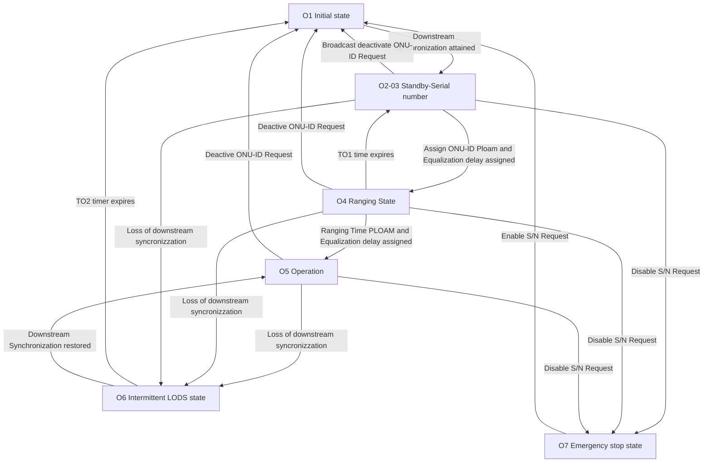

# GPON Status: Ox
The process for an ONU to go online unconfigured involves five states:

- **O1 Initial:** the OLT sends a message to the ONU to start the ONU, and the ONU enters the standby state;
- **O2 Standby:** After receiving the message, the ONU extracts the delimiter value, power level, and pre-allocated compensation delay from the message, and adjusts its configurations accordingly to support subsequent information exchange.
- **O3 Serial number:** The OLT sends a serial number (SN) request to the ONU. The ONU sends its SN to the OLT. After receiving the SN of the ONU, the OLT allocates a temporary ONU ID to the ONU.
- **O4 Ranging:** The OLT sends a ranging request to the ONU. After receiving the ranging request from the OLT, the ONU responds with a message carrying its SN and ONU ID. The OLT calculates the compensation delay and sends it to the ONU in a message. After receiving the message, the ONU sets the compensation delay accordingly.
- **O5 Operation:** The OLT sends a password request to the ONU. The ONU returns a password to the OLT. 
- **O6 Intermittent LODS state.**
- **O7 Emergency Stop state.**

The password is not configured on the OLT. If the automatic discovery function is enabled on the PON port of the OLT, the OLT reports an ONU auto-discovery alarm to the CLI or NMS. The ONU goes online normally only after being confirmed.

