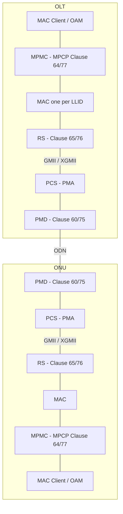
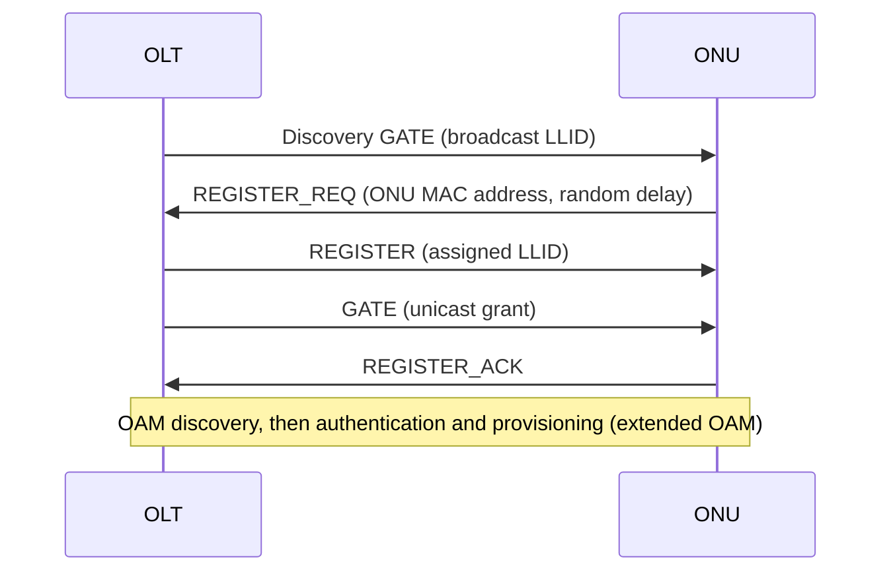

The information on this page is taken from the IEEE 802.3 EPON standard and from the presentations of the IEEE P802.3av and NG-EPON task forces, each individual item containing a verifiable citation. Feel free to cite this page as: <CiteAs />.

EPON (Ethernet Passive Optical Network) is the IEEE alternative to the ITU-T GPON/XGS-PON family[^ieee-xplore]. While GPON wraps Ethernet frames inside its own transmission convergence layer (GEM), EPON carries native Ethernet frames over the same point-to-multipoint passive optical network: the OLT and the ONUs are Ethernet stations and the PON specific functions are added as an extension of the Ethernet MAC and PHY layers[^802.3-2015].

# Standards

| Standard                    | Year | Name                      | Clauses                                                       | Downstream / Upstream |
| --------------------------- | ---- | ------------------------- | ------------------------------------------------------------- | --------------------- |
| IEEE 802.3ah                | 2004 | 1G-EPON (EFM)             | 56-67: PMD (60), MPCP (64), RS/FEC (65), OAM (57)              | 1 / 1 Gb/s            |
| IEEE 802.3av                | 2009 | 10G-EPON                  | 75: PMD, 76: RS/PCS/PMA, 77: MPCP, Annex 75A: coexistence      | 10 / 1 or 10 / 10 Gb/s |
| IEEE 802.3bk                | 2013 | Extended EPON             | adds the PX30, PX40, PRX40 and PR40 power budgets              |                       |
| IEEE 802.3-2015 (Section 5) | 2015 | Consolidated EPON clauses | 1G-EPON and 10G-EPON merged into the base standard[^802.3-2015] |                       |
| IEEE 802.3ca                | 2020 | 25G/50G-EPON (NG-EPON)    | 141-144                                                       | 25 or 50 / 10, 25 or 50 Gb/s |
| IEEE 1904.1 (SIEPON)        | 2013 | Service Interoperability  | system level management, see [SIEPON](#siepon-and-the-management-of-the-onu) |   |

IEEE 802.3 only defines the physical layer, the multipoint MAC control and the basic OAM: it does not define how an ONU is provisioned (VLANs, services, VoIP, etc.). This part, which in GPON is covered by OMCI, is defined by the operators and by IEEE 1904.1 (SIEPON).

# Protocol stack

EPON reuses the Ethernet layers and adds a Multipoint MAC Control (MPMC) sublayer and an extension of the Reconciliation Sublayer (RS), in order to emulate a point-to-point link for each ONU over the point-to-multipoint plant[^hajduczenia-av].

In the asymmetric 10/1G-EPON the OLT uses the XGMII in the transmit path and the GMII in the receive path, while the ONU does the opposite: each interface is used in a single direction only[^hajduczenia-av].

## LLID and point-to-point emulation

Every logical link between the OLT and an ONU is identified by a 15 bit LLID (Logical Link IDentifier), assigned by the OLT during the registration. The LLID and a mode bit are carried inside the Ethernet preamble, which is partially replaced and protected by a CRC8: in this way the frames stay standard Ethernet frames while each ONU can discard the frames not addressed to it[^802.3-2015]. The broadcast LLID is `0x7FFF` for 1G-EPON and `0x7FFE` for 10G-EPON.

An example of a captured 10G-EPON preamble is shown in the [Free/Iliad](/epon/free_iliad) page.

## MPCP (Multi-Point Control Protocol)

The upstream is shared in TDMA: the OLT decides when each ONU can transmit. MPCP is a MAC Control protocol with five messages (MPCPDUs)[^hajduczenia-av]:

| MPCPDU         | Direction  | Usage                                                                                                  |
| -------------- | ---------- | ------------------------------------------------------------------------------------------------------ |
| `GATE`         | OLT → ONU  | grants a transmission window; the *Discovery GATE* opens a discovery window for the unregistered ONUs |
| `REPORT`       | ONU → OLT  | reports the queue status of the ONU, used by the DBA                                                    |
| `REGISTER_REQ` | ONU → OLT  | registration request sent in the discovery window, it carries the MAC address of the ONU              |
| `REGISTER`     | OLT → ONU  | assigns the LLID to the ONU                                                                             |
| `REGISTER_ACK` | ONU → OLT  | confirms the registration                                                                               |

In 10G-EPON (Clause 77) the Discovery GATE and the REGISTER_REQ have a new *Discovery Information* field, so that a dual-rate OLT can open separate 1G and 10G discovery windows and the ONU can declare whether it is 1G and/or 10G upstream capable. REGISTER_REQ and REGISTER also carry the laser on/off times of the ONU[^hajduczenia-av].

Since the ONU is identified by its MAC address during the registration, the MAC address in EPON plays the role of the GPON serial number: the OLT can authenticate the ONU by MAC address, or by LOID (Logical ONU ID) and password through the extended OAM (see below).

# Physical layer

## Coding, line rate and FEC

| Parameter       | 1G-EPON                          | 10G-EPON                                         | 25G/50G-EPON          |
| --------------- | -------------------------------- | ------------------------------------------------ | --------------------- |
| Line coding     | 8b/10b                           | 64b/66b                                          | 64b/66b               |
| Line rate       | 1.25 GBd                         | 10.3125 GBd                                      | 25.78125 GBd per wavelength |
| MAC interface   | GMII                             | XGMII (GMII for the 1G direction of 10/1G-EPON)  | 25GMII                |
| FEC             | RS(255,239), optional, frame based | RS(255,223), mandatory, stream based           | LDPC                  |

In 10G-EPON the FEC is always enabled and stream based: the overhead is constant (12.9%), it is accommodated by deleting the extra IDLE characters in the PCS, so that the XGMII and the line rate are not super-rated. The burst mode PMA adds a synchronization pattern and the *Start_of_Burst* and *End_of_Burst* delimiters[^hajduczenia-av].

## PMD and power budgets

The PMD names follow a simple rule[^hajduczenia-av]:

- `P` stands for PON;
- `X` stands for 8b/10b coding, `R` for 64b/66b coding (`PRX` is asymmetric: 64b/66b downstream, 8b/10b upstream);
- the number after the letters is the power budget (`10`, `20`, `30`, ...) in 1G-EPON or the configuration (`1`, `2`, `3`) in 10G-EPON;
- `D` is the OLT (downstream) side, `U` is the ONU (upstream) side.

For example `1000BASE-PX20-U` is a 1G-EPON ONU with the 20 power budget, while `10/1GBASE-PRX-U2` is an asymmetric 10G-EPON ONU with the PRX20 power budget.

| Power budget  | Standard | Downstream             | Upstream               | Max ChIL | Min ChIL | Nominal reach / split |
| ------------- | -------- | ---------------------- | ---------------------- | -------- | -------- | --------------------- |
| PX10          | 802.3ah  | 1.25 GBd, 1490 nm      | 1.25 GBd, 1310 nm      | 20 dB    | 5 dB     | 10 km 1:16            |
| PX20          | 802.3ah  | 1.25 GBd, 1490 nm      | 1.25 GBd, 1310 nm      | 24 dB    | 10 dB    | 20 km 1:16            |
| PRX10         | 802.3av  | 10.3125 GBd, 1577 nm   | 1.25 GBd, 1310 nm      | 20 dB    | 5 dB     | 10 km 1:16            |
| PRX20         | 802.3av  | 10.3125 GBd, 1577 nm   | 1.25 GBd, 1310 nm      | 24 dB    | 10 dB    | 20 km 1:16            |
| PRX30         | 802.3av  | 10.3125 GBd, 1577 nm   | 1.25 GBd, 1310 nm      | 29 dB    | 15 dB    | 20 km 1:32            |
| PR10          | 802.3av  | 10.3125 GBd, 1577 nm   | 10.3125 GBd, 1270 nm   | 20 dB    | 5 dB     | 10 km 1:16            |
| PR20          | 802.3av  | 10.3125 GBd, 1577 nm   | 10.3125 GBd, 1270 nm   | 24 dB    | 10 dB    | 20 km 1:16            |
| PR30          | 802.3av  | 10.3125 GBd, 1577 nm   | 10.3125 GBd, 1270 nm   | 29 dB    | 15 dB    | 20 km 1:32            |

The nominal reach and split are informative only: devices that exceed them are still compliant. PRX30 has no 1G-EPON counterpart in 802.3ah[^hajduczenia-av].

## Wavelength plan

| Signal                   | Band                          |
| ------------------------ | ----------------------------- |
| 1G-EPON downstream       | 1480 - 1500 nm                |
| 1G-EPON upstream         | 1260 - 1360 nm (wideband), 1290 - 1330 nm (narrowband) |
| 10G-EPON downstream      | 1575 - 1580 nm                |
| 10G-EPON upstream (PR)   | 1260 - 1280 nm                |
| 10G-EPON upstream (PRX)  | 1260 - 1360 nm (1G upstream)  |
| RF video overlay         | 1550 - 1560 nm                |

Note that the 10G-EPON downstream (1577 nm) and upstream (1270 nm) wavelengths are the same as XGS-PON, while the 1G-EPON wavelengths are the same as GPON: for this reason an EPON and a GPON ONU can have the same optics but they are not interchangeable, since the line coding and the protocol are different.

## Coexistence of 1G-EPON and 10G-EPON

10G-EPON is designed to coexist with 1G-EPON on the same ODN (Annex 75A)[^hamano],[^hajduczenia-ng]:

- **downstream**: the 1G and 10G signals are WDM multiplexed (1490 nm and 1577 nm), so they are independent;
- **upstream, TDM coexistence**: the 1G and 10G ONUs share the 1260-1360 nm band in TDMA, and the OLT has a dual-rate burst-mode receiver that detects the rate of each burst at the PHY layer; this is required by the wideband 1G-EPON ONUs (Fabry-Perot lasers);
- **upstream, WDM coexistence**: with narrowband 1G-EPON ONUs (DFB lasers, 1290-1330 nm) the 1G and 10G OLT ports can be separate and WDM multiplexed, so that both upstream channels are independent.

| Dual-rate operation              | OLT PMD                                 | ONU PMDs on the same ODN                                |
| -------------------------------- | --------------------------------------- | ------------------------------------------------------- |
| Downstream                       | 1000BASE-PX-D + 10/1GBASE-PRX-D         | 1000BASE-PX-U, 10/1GBASE-PRX-U                          |
| Upstream                         | 10GBASE-PR-D + 10/1GBASE-PRX-D          | 10GBASE-PR-U, 10/1GBASE-PRX-U                           |
| Downstream and upstream          | 1000BASE-PX-D + 10GBASE-PR-D            | 1000BASE-PX-U, 10/1GBASE-PRX-U, 10GBASE-PR-U            |

Only the PMDs with a compatible power budget can be connected to the same ODN[^hamano].

# SIEPON and the management of the ONU

IEEE 802.3 defines a basic OAM (Clause 57, *Slow Protocol* with Ethertype `0x8809`), used for link monitoring and loopback, which can be extended with organization specific TLVs. The provisioning of the ONU (bridging, VLANs, multicast, voice, firmware upgrade, etc.) is carried in these extended OAM messages, and it is different for each family of networks. IEEE 1904.1 (SIEPON) collects them in three packages:

| Package           | Origin                                      | Notes                                                                               |
| ----------------- | ------------------------------------------- | ----------------------------------------------------------------------------------- |
| SIEPON Package-A  | DPoE (DOCSIS Provisioning over EPON), CableLabs | used by cable operators, the ONU is managed like a DOCSIS cable modem, encryption with 802.1AE (MACsec) |
| SIEPON Package-B  | NTT (Japan)                                 |                                                                                     |
| SIEPON Package-C  | CTC (China Telecom)                         | the most common on the market, authentication by MAC or LOID and password           |

Since the ONU behaviour depends on the extended OAM implemented by the firmware, an ONU of one package does not usually work on a network of another package: for example the [CIG](/epon/CIG) ONUs are sold as SIEPON Package-C, but they can be switched to Package-A by installing a custom firmware.

# Comparison with GPON and XGS-PON

| Feature               | 1G-EPON          | GPON (G.984)              | 10G-EPON              | XGS-PON (G.9807.1)        |
| --------------------- | ---------------- | ------------------------- | --------------------- | ------------------------- |
| Organization          | IEEE             | ITU-T                     | IEEE                  | ITU-T                     |
| Downstream            | 1.25 GBd (1 Gb/s) | 2.488 Gb/s               | 10.3125 GBd (10 Gb/s) | 9.953 Gb/s                |
| Upstream              | 1.25 GBd (1 Gb/s) | 1.244 Gb/s               | 1.25 or 10.3125 GBd   | 9.953 Gb/s                |
| Encapsulation         | native Ethernet  | GEM                       | native Ethernet       | XGEM                      |
| ONU identification    | MAC address, LLID | Serial Number, ONU-ID    | MAC address, LLID     | Serial Number, ONU-ID     |
| Authentication        | MAC, LOID/password (CTC) | Serial Number, PLOAM password, LOID (OMCI) | MAC, LOID/password (CTC), certificates (DPoE) | Serial Number, registration ID, LOID |
| ONU management        | extended OAM     | OMCI                      | extended OAM          | OMCI                      |
| Downstream wavelength | 1490 nm          | 1490 nm                   | 1577 nm               | 1577 nm                   |
| Upstream wavelength   | 1310 nm          | 1310 nm                   | 1270 nm               | 1270 nm                   |

See [GPON G.984 Series](/g_984_series) for the GPON standard.

---

[^802.3-2015]: *IEEE Standard for Ethernet*, IEEE Std 802.3-2015, Section Five https://www.onetel.de/wp-content/uploads/2016/11/802.3-2015_SECTION5.pdf
[^hajduczenia-av]: Hajduczenia M., *Overview of 10G-EPON*, IEEE P802.3av interim, Shanghai, June 2009 https://grouper.ieee.org/groups/802/3/av/public/2009_06/3av_0906_hajduczenia_1.pdf
[^hamano]: Hamano H., *75.6 Dual-rate (coexistence) mode*, IEEE P802.3av, November 2008 https://www.ieee802.org/3/av/public/2008_11/3av_0811_hamano_1.pdf
[^hajduczenia-ng]: Hajduczenia M., *WDM coexistence for 1G/10G/NG-EPON*, IEEE 802.3 NG-EPON Study Group, September 2015 https://www.ieee802.org/3/NGEPONSG/public/2015_09/ngepon_1509_hajduczenia_2.pdf
[^ieee-xplore]: IEEE Xplore, document 6138784 https://ieeexplore.ieee.org/document/6138784
