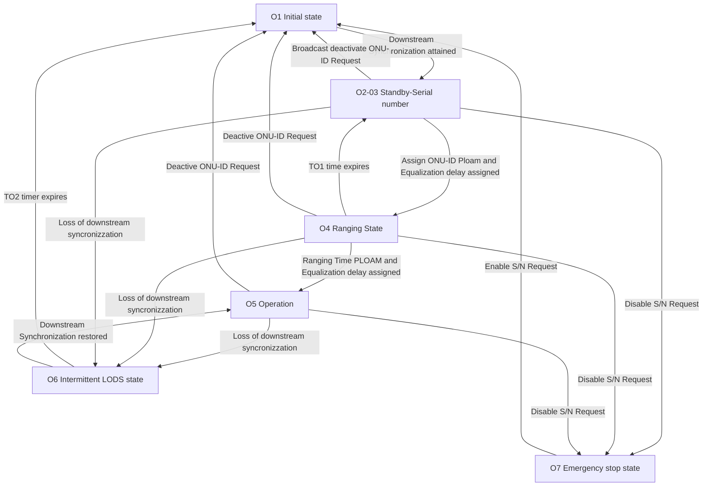

The information on this page is taken from the GPON standard and information from the major vendors of GPON equipment, each individual item containing a verifiable citation in the standard. Feel free to cite this page as: `{{ $frontmatter.title }}, Hack GPON. Available at: https://hack-gpon.org{{ $page.filePath }}`.

# ONU activation state: `Ox`[^huawei],[^standardgpon]
The process for an unconfigured ONU to go online involves five states:

- **`O1` Initial:** the OLT sends a message to the ONU to start the ONU, and the ONU enters the standby state;
- **`O2` Standby:** After receiving the message, the ONU extracts the delimiter value, power level, and pre-allocated compensation delay from the message, and adjusts its configurations accordingly, to support subsequent information exchanges.
- **`O3` Serial number:** The OLT sends a serial number (SN) request to the ONU. The ONU sends its SN to the OLT. After receiving the ONU's SN, the OLT allocates a temporary ONU-ID to the ONU.
- **`O4` Ranging:** The OLT sends a ranging request to the ONU. After receiving the ranging request from the OLT, the ONU responds with a message carrying its SN and ONU-ID. The OLT calculates the compensation delay and sends it to the ONU in a message. After receiving the message, the ONU sets the compensation delay accordingly.
- **`O5` Operation:** The OLT sends a password request to the ONU. The ONU returns a password to the OLT. 
- **`O6` Intermittent LODS state.**
- **`O7` Emergency Stop state.**

The password is not configured on the OLT: if the automatic discovery function is enabled on the OLT's PON port, the OLT reports an ONU auto-discovery alarm to the CLI or NMS. The ONU goes online normally only after being confirmed.

# Fake O5 Status[^anime4000]

There is a known issue with Alcatel/Nokia OLTs giving fake `O5` ONU Status, OLTs will hold OMCI Provisioning until correct OMCI Information is received.

This happens when the OLT detects that the ONT is `drunk`, so it tries to update the firmware before opening the GEM link. If this happens, the user has to try changing the software version or other data.

This is most likely to reduce logs from misconfigured ONTs and to be able to send updates automatically to ONTs.

[^huawei]: *The Process for an ONU to go Online* https://forum.huawei.com/enterprise/en/the-process-for-an-onu-to-go-online-gpon-technical-posts-12/thread/462895-100181
[^standardgpon]: *G.984.3: Gigabit-capable passive optical networks (GPON): Transmission convergence layer specification* https://www.itu.int/rec/T-REC-G.984.3
[^anime4000]: *`O5` No Internet* https://github.com/Anime4000/RTL960x/blob/main/Docs/fakeO5.md