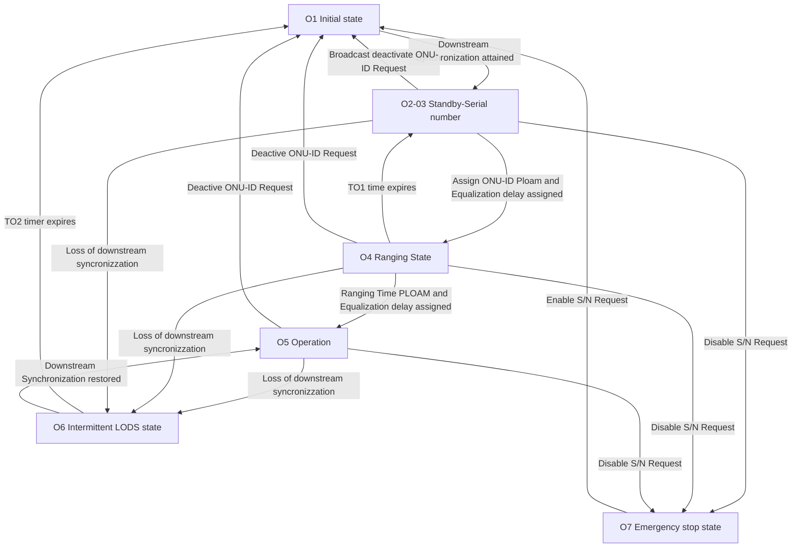

The information on this page is taken from the GPON standard and information from the major vendors of GPON equipment, each individual item containing a verifiable citation in the standard. Feel free to cite this page as: <CiteAs />.

# ONU activation state: `Ox`[^huawei],[^standardgpon]
The process for an unconfigured ONU to go online involves five states:

- **`O1` Initial:** the OLT sends a message to the ONU to start the ONU, and the ONU enters the standby state;
- **`O2` Standby:** After receiving the message, the ONU extracts the delimiter value, power level, and pre-allocated compensation delay from the message, and adjusts its configurations accordingly, to support subsequent information exchanges.
- **`O3` Serial number:** The OLT sends a serial number (SN) request to the ONU. The ONU sends its SN to the OLT. After receiving the ONU's SN, the OLT allocates a temporary ONU-ID to the ONU.
- **`O4` Ranging:** The OLT sends a ranging request to the ONU. After receiving the ranging request from the OLT, the ONU responds with a message carrying its SN and ONU-ID. The OLT calculates the compensation delay and sends it to the ONU in a message. After receiving the message, the ONU sets the compensation delay accordingly.
- **`O5` Operation:** The OLT sends a password request to the ONU. The ONU returns a password to the OLT. 
- **`O6` Intermittent LODS state.**
- **`O7` Emergency Stop state.**

The password is not configured on the OLT: if the automatic discovery function is enabled on the OLT's PON port, the OLT reports an ONU auto-discovery alarm to the CLI or NMS. The ONU goes online normally only after being confirmed.

```mermaid
graph TD
    O1[O1 Initial state] -->|Downstream Synchronization attained| O2[O2-03 Standby-Serial number]
    O2 -->|Assign ONU-ID Ploam and Equalization delay assigned| O4[O4 Ranging State]
    O4 -->|Ranging Time PLOAM and Equalization delay assigned| O5[O5 Operation]
    O5 & O4 &  O2 -->|Loss of downstream syncronizzation| O6[O6 Intermittent LODS state]
    O2 ---->|Disable S/N Request| O7[O7 Emergency stop state]
    O2 -->|Broadcast deactivate ONU-ID Request| O1
    O4 --->|TO1 time expires| O2
    O4 & O5 ---->|Disable S/N Request| O7
    O7 ---->|Enable S/N Request| O1
    O6 ---->|TO2 timer expires| O1
    O6 -->|Downstream Synchronization restored| O5
    O5 & O4 ---->|Deactive ONU-ID Request| O1
```

# Fake O5 Status[^anime4000]

There is a known issue with Alcatel/Nokia OLTs giving fake `O5` ONU Status, OLTs will hold OMCI Provisioning until correct OMCI Information is received.

This happens when the OLT detects that the ONT is `drunk`, so it tries to update the firmware before opening the GEM link. If this happens, the user has to try changing the software version or other data.

This is most likely to reduce logs from misconfigured ONTs and to be able to send updates automatically to ONTs.

The same happens on other OLTs that support any ONU (e.g. Fiberhome, Calix and Nokia): the ONU reaches `O5` even with a wrong serial number or PLOAM password, but the OLT does not send the VLAN configuration (ME 84 and ME 171)[^rtl960x]. To fix it:

- check again the serial number and the PLOAM password;
- clone all the identity values of the original ONT: vendor ID, equipment ID, hardware and software versions, OMCC version and, for some OLTs, OUI, hardware serial number and MAC address;
- some ISPs require vendor specific MEs (350-399), which a stick may not be able to emulate.

On the Realtek based sticks, `OMCI_FAKE_OK` (reply OK to every OMCI message) and `OMCI_OLT_MODE` (vendor compatibility mode) can help, see for example the [ODI DFP-34X-2C2](/ont-odi-realtek-dfp-34x-2c2#gpon-omci-settings). Some ISPs keep the OMCI configuration in cache on the OLT: e.g. Chunghwa Telecom (Taiwan) can reset the line from its support. Some ISPs blacklist the PON port after a few failed attempts (e.g. Movistar Chile after 3 attempts), and the reset requires a technician[^anime4000].

# `O2`-`O5` loop

The ONU cycles between `O2` and `O5` without ever staying in `O5`[^rtl960x]:

- the OLT does not accept the ONU identity, as in the [Fake O5](#fake-o5-status) case, e.g. with some Fiberhome OLTs, or with PLDT (Philippines) when a SFU firmware is used instead of an HGU one;
- the received optical power is too low (e.g. ≤ -23 dBm): clean the connectors and check the RX power again.

::: danger Warning
If the ONU still does not work after checking all the values, stop: every failed attempt is logged by the OLT, and a misbehaving ONU can disrupt the whole PON tree, with service suspension or penalties from the ISP.
:::

[^huawei]: *The Process for an ONU to go Online* https://forum.huawei.com/enterprise/en/the-process-for-an-onu-to-go-online-gpon-technical-posts-12/thread/462895-100181
[^standardgpon]: *G.984.3: Gigabit-capable passive optical networks (GPON): Transmission convergence layer specification* https://www.itu.int/rec/T-REC-G.984.3
[^anime4000]: *`O5` No Internet* https://github.com/Anime4000/RTL960x/blob/main/Docs/fakeO5.md
[^rtl960x]: *Hacking RTL960x: Fake O5 State and O2-O5 Loop*, Anime4000/RTL960x https://github.com/Anime4000/RTL960x