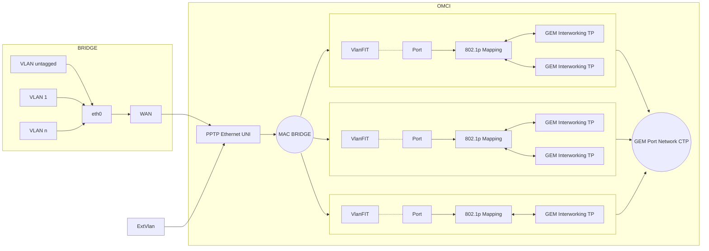
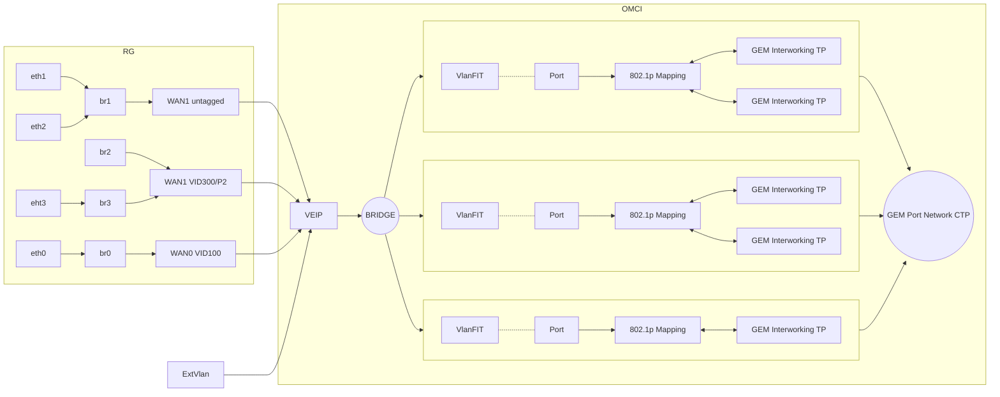

ONTs are the terminating elements of every PON network and play an essential role in the PON architecture. The ONT converts the optical media into an electrical interface and takes care of authenticating, monitoring, processing as well as managing all matters related to the GPON tree. Often these devices are installed directly in users' homes[^hsgp_hg_sfu].

Three layers can be identified in the ONT: core layer, service layer and public layer.
- The core layer provides multiplexing and the optical interface;
- the service layer refers mainly to the user port;
- the public layer provides power and maintenance management[^hsgp_hg_sfu].

ONTs can connect to various terminal devices, such as set-top boxes, wireless routers, TVs, etc., and perform photoelectric conversion, maintenance and monitoring functions. According to the application, ONTs can be divided into six types, namely[^hsgp_hg_sfu]:
- SFU (Single Family Unit) ONT
- HGU (Home Gateway Unit) ONT 
- MDU (Multi-Dwelling Unit) ONT 
- SBU (Single Business Unit) ONT 
- MTU (Multi-Tenant Unit) ONT
- CBU (Cellular Backhaul Unit) ONT

However, only SFU ONTs and HGU ONTs are used by end-users in practical application.

HGU ONTs are a home gateway with a PON uplink interface; they're designed for use in single home units. HGU ONTs integrate the functions of ONTs and RGs to realize more complex control and management and also provide Ethernet / IP, VoIP, optional CATV services and routing mode (firewall and NAT). Usually HGU ONTs have Ethernet interfaces, but POTS, WLAN, USB and CATV RF interfaces are also available. The HGU is a Layer III device[^hsgp_hg_sfu].

The ONT SFU type can be understood as a simple Layer II device, like an L2 switch or media converter. It usually has a single Ethernet port and it is exclusively an optical-electric converter. It simply and transparently transports traffic from the PON interface to the Ethernet port(s) of the customer's ONT. No routing or VoIP functionality is assumed for this SFU type. For SFUs, a simple service configuration from the OLT station is used. SFU devices are usually cheaper, because additional services (routing, telephony, TV) are not implemented.

Within the GPON OMCI standards we can find two types of interfaces: VEIP and PPTP. These virtual interfaces are the boundary between the GPON/OMCI part and the non-GPON/Ethernet part[^G_984_4],[^G_988],[^hsgp_hg_sfu].

ONTs will report VEIP or PPTP (Physical Path Termination Point) when MIB 11 or 329 is uploaded according to the type of the device. Only one VEIP is allowed in a HGU and VEIP is not available for SFU devices. OLTs determine the ONT type based on the ONT Type attribute in ME Capability.

# Physical Path Termination Point (PPTP/Ethernet UNI - MIB 11)

PPTP/EthUni, on the other hand, is designed for transparent L2 bridging, potentially each with its own VLAN. The OLT is responsible of the provisioning of VLANs and LAN Ports[^nanomad_fc],[^anime_rtl960x].

The SFU type ONT device is configured and controlled completely remotely by the OLT via the OMCI management interface. Generally these devices do not require special configurations and therefore access to the web interface of the client ONT device is not required, although it is possible to update the software. To configure the switching of the required VLANs, the Ethernet port profiles of the client ONT are created at the OLT. Most user-side configurations must be made in the devices connected to the SFU.

For OMCI data flow, there is a mutually unambiguous mapping between the GEM port on the OLT side with the UNI Ethernet port on the terminal side of the ONT. All data packets can pass through without learning or forwarding the MAC address. SFU ONTs support multiple VLANs through bridge mode.

Source [^cablefax_future], [^G_988]

# Virtual Ethernet Interface Point (VEIP - MIB 329)

VEIP is a service profile designed to terminate the connection directly on the CPE, providing various services (voice, data, video) each with its own characteristics. It allows multiple Ethernet services to be carried over a single PON link. VEIP virtualises all interfaces of the ONU.

Similarly, all UNI-side modules within a VEIP are invisible to and cannot be managed by OMCI or the user. They are only visible and manageable to a management domain other than OMCI. In addition, each ONT must have only one VEIP.

In some countries, it is also used to allow quick switches between ISPs: ISP A is assigned to Ethernet port 1 of the HGU, ISP B is assigned to Ethernet port 2 of the HGU, and so on[^nanomad_fc],[^anime_rtl960x],[^huawei_veip].

Source [^hsgp_hg_sfu]

---

[^G_988]: *G.988: ONU management and control interface (OMCI) specification* https://www.itu.int/rec/T-REC-G.988
[^G_984_4]: *G.984.4: Gigabit-capable Passive Optical Networks (G-PON): ONT management and control interface specification* https://www.itu.int/rec/T-REC-G.988
[^hsgp_hg_sfu]: *Differences between HGU ONU and SFU ONU*  https://hsgq.com/optical-module/296.html
[^anime_rtl960x]: *Hacking RTL960x*  https://github.com/Anime4000/RTL960x
[^nanomad_fc]: *XGS-PON - ONT SFP+ su router proprietario*  https://forum.fibra.click/d/39131-xgs-pon-ont-sfp-su-router-proprietario/12
[^huawei_veip]: *VEIP knowledge*  https://forum.huawei.com/enterprise/en/veip-knowledge/thread/771975-100181
[^cablefax_future]: *PONs: Why Testing For Conformance And Interoperability Are Key To Their Future*  https://www.cablefax.com/archives/pons-why-testing-for-conformance-and-interoperability-are-key-to-their-future