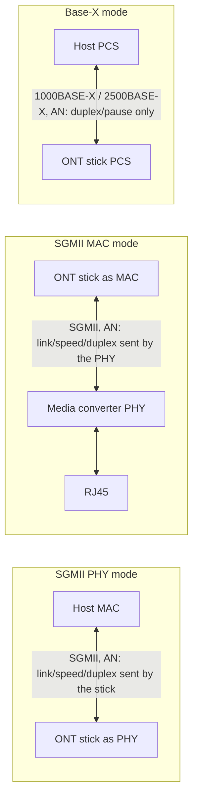

The organisation that developed SFPs (MSA SFP) has always been very cautious about defining a hardened list of admissible signals for SFPs, their first standard only providing pinout, form-factor and dissipative capacity specifications. It is up to the manufacturer to decide which communication to use in the Tx and Rx pins[^sfpstandard]. 
After the SFP standard entered the market, in the early 2000s with Ethernet and Fibre Channel, the MSA SFP also started standardising signalling, starting with [^sfprate] and [^sfprate2] which define a list of admissible standard signalling limited to the capabilities of the current form factor SFP.
With the need to increase the heat dissipation characteristics of the modules (in order to increase speeds) and to allow some additions to the EEPROM, an additional standard, called SFP+[^sfpplusstandard],[^sfpplusmi],[^xenpak_xfp], was developed, which contains all the aforementioned improvements. The 16GFC, 20GFC signalling for Fibre Channel and the 10 Gbps and 2.5 signalling for Ethernet were also included in the updated [^sfprate] and [^sfprate2] standard. Some of these are also included in [^sfpplusstandard] locking the SFP+ standard to a tenth of signalling, all other signals should fall under the SFP standard[^sfpstandard], but they can use the extended SFP+ management interface[^sfpplusmi].

# Ethernet over the SFP: MII and Base-X

The Ethernet signals carried on the SFP pins are all very similar, but there are some important differences between the *Base-X* interfaces and the *MII* family. The media-independent interface (MII) was defined in the IEEE 802.3u standard. It was originally defined as a standard interface to connect a Fast Ethernet MAC block (i.e. CPU, switch) to a PHY chip (i.e. twisted pair, fiber optic, etc.) in a standardised way. The main advantage is that MII can be used without redesigning or replacing the MAC hardware. Thus any MAC may be used with any PHY, independent of the network signal transmission media[^ethernet].

The main differences are:
- *Base-X* is an Ethernet PHYsical layer (layer 1) standard: it describes the signal on the medium (fiber, twinax copper) and it uses the 8B/10B coding (or other encodings, such as 64B/66B for 10GBASE-R, as specified in the EEPROM). *MII* is the interface towards the Ethernet MAC device (layer 2, the device that actually makes and receives Ethernet frames)[^ethernet].
- *Base-X* is **symmetric**: both ends of the link are equal and the auto-negotiation (IEEE 802.3 Clause 37) only exchanges the duplex and flow-control (pause) abilities, the speed is fixed. *SGMII* is **asymmetric**: one end is the *PHY side* and the other one is the *MAC side*. The PHY side sends to the MAC side the link status, the speed and the duplex of the medium past the PHY, the MAC side only acknowledges them. Even though the MAC-to-PHY SGMII link is always 1.25 GBd, it supports 10, 100 and 1000 Mbps past the PHY and the MAC needs to know this to space out the bits properly (e.g. if the external link is 100 Mbps, each bit on the SGMII link is sent 10 times)[^sgmii].

MII can be used to connect a MAC to an external PHY using a pluggable connector, or directly to a PHY chip on the same PCB. In the first case it is also used in SFP connectors, for example to allow connections between two MAC blocks without passing through a PHY (i.e. passive DAC).
This technology, and in particular its evolutions such as RGMII[^rgmii], SGMII[^sgmii], QSGMII[^qsgmii], XGMII[^intel], USXGMII[^xilinx], is widely used as a communication bus, while on the SFP pins only the serial ones (SGMII, USXGMII and their overclocked variants) can be used, in addition to the IEEE Base-X[^ethernet]. The 2.5G-SGMII or HSGMII[^altium] and 10G-SGMII or XSGMII[^aquantia] are vendor specific interfaces that increase the clock speed of the SGMII standard without redefining it.

## PHY mode, MAC mode and Base-X

Since SGMII is asymmetric, a device that speaks SGMII must know which side it is. Many ONT sticks (e.g. the Realtek based ones, see `sgmii_mode` or `LAN_SDS_MODE` in the device pages) can be configured in all these modes:

- **SGMII/HSGMII PHY mode**: the stick behaves like a copper SFP with a PHY inside: it is the PHY side and the host (router, switch, NIC) is the MAC side. This is the mode expected by a host that supports SGMII, and it is the same mode used by the 1000BASE-T copper SFPs, which have a PHY (e.g. Marvell 88E1111) behind the SFP pins.
- **SGMII/HSGMII MAC mode**: the stick behaves like a MAC, so it must be connected to a PHY (e.g. a media converter with an Ethernet PHY between the SFP cage and the RJ45 port). Two devices in MAC mode do not link, since nobody sends the link information.
- **Base-X mode** (1000BASE-X, 2500BASE-X): the stick behaves like an optical transceiver: there is no PHY side or MAC side, the speed is fixed and only duplex and pause are negotiated (or the negotiation is disabled).

The modes are not interchangeable: an SGMII host with the in-band auto-negotiation enabled does not link with a stick in Base-X mode and vice versa, even if the line rate and the encoding are the same. When the auto-negotiation is disabled on both sides, an SGMII link at 1 Gbps and a 1000BASE-X link look the same on the wire, and this is why many devices work in both cases.

## The Linux kernel point of view

The Linux kernel (phylink and the SFP subsystem) models exactly these interfaces, and it is a good reference for how a host chooses the mode[^linux-phylink]:

- the interface between the MAC and the SFP is described by the `phy-mode` (`phy_interface_t`) property in the device tree, for example `sgmii`, `1000base-x`, `2500base-x`, `5gbase-r`, `10gbase-r`, `usxgmii`; `xgmii` and `rgmii` exist too, but they are parallel interfaces used on the PCB and never on the SFP pins;
- the in-band auto-negotiation is enabled with `managed = "in-band-status"`, otherwise the link is forced (`fixed-link`);
- when a module is inserted, `sfp_parse_support()` (in `drivers/net/phy/sfp-bus.c`) reads the EEPROM compliance codes and builds the list of the supported link modes and interfaces; if no compliance code is set it uses the nominal signaling rate: a module between 1.2 and 1.3 GBd is treated as `1000base-x`, a module between 2.5 and 3.2 GBd is treated as `2500base-x`[^linux-sfpbus];
- when the module contains a PHY (e.g. a 1000BASE-T copper SFP with the PHY on the I2C address `0x56`), the kernel probes it and uses `sgmii` with the module as the PHY side;
- the modules that declare wrong values in the EEPROM are fixed with quirks in `drivers/net/phy/sfp.c`, for example the [Nokia G-010S-P](/ont-nokia-g-010s-p) (`ALCATELLUCENT G010SP`) and the [Huawei MA5671A](/ont-huawei-ma5671a) (`HUAWEI MA5671A`) are forced to `2500base-x`[^linux-sfp].

The EEPROM content of a module can be read with `ethtool -m <interface>`.

# Interfaces table

The following table lists the interfaces used on the SFP pins, with the values that a module should declare in the SFF-8472 EEPROM (address `0xA0`)[^sfpplusmi],[^sff8024]:

- **Compliance**: transceiver compliance codes, byte 3 (10G Ethernet), byte 6 (Ethernet) or byte 36 (extended compliance codes, SFF-8024);
- **Encoding**: byte 11 (`01h` 8B/10B, `02h` 4B/5B, `06h` 64B/66B);
- **BR, Nominal**: byte 12, nominal signaling rate in units of 100 MBd;
- **Rate identifier**: byte 13, it is used for the rate select of the Fibre Channel modules, it is `00h` (unspecified) for the Ethernet modules.

| Interface               | Standard                                          | Data rate               | Signaling rate             | Encoding | In-band auto-negotiation                  | Compliance (SFF-8472/8024)                                                                    | Encoding | BR, Nominal | Linux `phy-mode`                           |
| ----------------------- | ------------------------------------------------- | ----------------------- | -------------------------- | -------- | ----------------------------------------- | --------------------------------------------------------------------------------------------- | -------- | ----------- | ------------------------------------------ |
| 100BASE-FX              | IEEE 802.3 Clause 24/26                           | 100 Mbps                | 125 MBd                    | 4B/5B    | No                                        | byte 6 bit 5 (100BASE-FX), bit 4 (100BASE-LX/LX10)                                             | `02h`    | `01h`       | `100base-x`                                |
| SGMII                   | Cisco ENG-46158[^sgmii]                           | 10/100/1000 Mbps        | 1.25 GBd                   | 8B/10B   | Yes, link/speed/duplex from the PHY side  | none, the copper SFPs declare byte 6 bit 3 (1000BASE-T)                                       | `01h`    | `0Ch`/`0Dh` | `sgmii`                                    |
| 1000BASE-X              | IEEE 802.3 Clause 36/37                           | 1000 Mbps               | 1.25 GBd                   | 8B/10B   | Yes, duplex/pause (Clause 37)             | byte 6 bit 0 (SX), 1 (LX), 2 (CX), 6 (BX10), 7 (PX)                                            | `01h`    | `0Ch`/`0Dh` | `1000base-x`                               |
| HSGMII (2.5G-SGMII)     | vendor specific[^altium]                          | 2500 Mbps               | 3.125 GBd[^rtl960x]        | 8B/10B   | Vendor specific, usually disabled         | none                                                                                          | `01h`    | `1Fh`       | none, `2500base-x` with AN disabled        |
| 2500BASE-X              | industry naming of the IEEE 802.3cb 2.5GBASE-X PCS | 2500 Mbps   | 3.125 GBd                  | 8B/10B   | Clause 37 like, usually disabled          | none, it is detected by the nominal rate                                                      | `01h`    | `1Fh`       | `2500base-x`                               |
| 2.5GBASE-T (copper SFP) | IEEE 802.3bz                                      | 2500 Mbps on the RJ45   | 3.125 GBd on the SFP pins  | 8B/10B   | Depends on the PHY inside the module      | byte 36 `1Eh`                                                                                 | `01h`    | `1Fh`       | `2500base-x`, or `sgmii` with rate matching |
| 5GBASE-R                | IEEE 802.3cb (5GBASE-KR PCS)                      | 5000 Mbps               | 5.15625 GBd                | 64B/66B  | No                                        | byte 36 `1Dh` (5GBASE-T copper SFP)                                                           | `06h`    | `33h`/`34h` | `5gbase-r`                                |
| 10GBASE-R (SFI)         | IEEE 802.3 Clause 49, SFF-8431[^sfpplusstandard]  | 10 Gbps                 | 10.3125 GBd                | 64B/66B  | No                                        | byte 3 bit 4 (SR), 5 (LR), 6 (LRM), 7 (ER); byte 36 `16h` or `1Ch` for the 10GBASE-T copper SFP+ | `06h` | `67h`       | `10gbase-r`                                |
| XSGMII (10G-SGMII)      | vendor specific[^aquantia]                        | 10 Gbps                 | 10.3125 GBd                | 64B/66B  | Vendor specific                           | none                                                                                          | `06h`    | `67h`       | none                                       |
| USXGMII                 | Cisco/Xilinx[^xilinx]                             | 10M/100M/1G/2.5G/5G/10G | 10.3125 GBd                | 64B/66B  | Yes, link/speed/duplex from the PHY side  | none                                                                                          | `06h`    | `67h`       | `usxgmii`                                  |

Some notes on the table:

- there is no compliance code for SGMII, HSGMII and the other MII interfaces: the EEPROM can only declare the medium (e.g. 1000BASE-T, 1000BASE-LX) and the nominal signaling rate, the MII mode is a convention between the host and the module;
- HSGMII and 2500BASE-X have the same line rate (3.125 GBd, which carries 2.5 Gbps with the 8B/10B coding) and the same coding, the only difference is the in-band auto-negotiation: for this reason a stick in HSGMII mode works on most 2500BASE-X hosts when the auto-negotiation is disabled[^rtl960x];
- some ONT sticks declare a nominal rate lower than 3.125 GBd (e.g. `19h`, 2.5 GBd) or a 1000BASE-X compliance code even if they work at 2.5 Gbps, this is why a host may need a quirk or a manual setting to use them at 2.5 Gbps;
- the BR, Nominal values are typical values: the unit is 100 MBd, so 1.25 GBd can be rounded to `0Ch` (1.2 GBd) or `0Dh` (1.3 GBd).

## 1000BASE-X variants

All these variants use 8B/10B at 1.25 GBd and they are seen by the host as 1000BASE-X, they only differ on the optical side[^ethernet],[^wiki-gbe]:

| Variant       | Medium                           | Wavelength                       | Typical reach | SFF-8472 byte 6 |
| ------------- | -------------------------------- | -------------------------------- | ------------- | --------------- |
| 1000BASE-SX   | Multi-mode fiber                 | 850 nm                           | 220 - 550 m   | bit 0           |
| 1000BASE-LX   | Single-mode or multi-mode fiber  | 1310 nm                          | 5 km (SMF)    | bit 1           |
| 1000BASE-LX10 | Single-mode fiber                | 1310 nm                          | 10 km         | bit 1           |
| 1000BASE-BX10 | Single-mode fiber, single strand | 1310 nm / 1490 nm (or 1550 nm)   | 10 km         | bit 6           |
| 1000BASE-EX   | Single-mode fiber (not IEEE)     | 1310 nm                          | 40 km         | none            |
| 1000BASE-ZX   | Single-mode fiber (not IEEE)     | 1550 nm                          | 70 km         | none            |
| 1000BASE-PX   | Single-mode fiber, EPON          | 1490 nm / 1310 nm                | 10 - 20 km    | bit 7           |
| 1000BASE-CX   | Twinax copper                    | -                                | 25 m          | bit 2           |
| 1000BASE-T    | Twisted pair (module with a PHY) | -                                | 100 m         | bit 3           |

Note that 1000BASE-PX is the 1G-EPON optical interface (see [EPON](/epon-standard)): in this case the SFP is an OLT or ONU transceiver and the 1.25 GBd signal is the PON signal itself, not an Ethernet link towards the host.

# How the interfaces are reported on Hack GPON

The ONT stick pages report the host interfaces supported by the stick in the **SFP interfaces** row of the hardware specifications table, using the names of the table above, e.g. `SGMII, 1000BASE-X, HSGMII, 2500BASE-X`. The ONT pages report the Ethernet ports (e.g. `2.5GBaseT`), the router pages report the interfaces supported by the SFP cage in the *SFP* row, and the SFP cage pages report the interfaces supported by the host. The sticks without a PON MAC do not use any of these interfaces, see [SFP with PON MAC and w/o PON MAC](/ont-wo-mac).

RGMII, SGMII and 1000BASE-X allow a speed of 1 Gbps, 2500BASE-X and HSGMII of 2.5 Gbps, 5GBASE-R of 5 Gbps, 10GBASE-R, XSGMII and USXGMII of 10 Gbps.

---
[^xenpak_xfp]: With the advent of higher speeds MSA has developed several new interfaces, such as XENPAK, X2, XPAK, XFP, but the newest standard is the transceiver is called SFP+. Based on the same form factor as SFP, it is smaller than its predecessors and has lower power than XFP. SFP+ has become the most popular socket on 10GbE systems because it shares a common physical form factor with legacy SFP modules, allowing higher port density than XFP and the reuse of existing designs for 24 or 48 ports in a 19-inch rack width blade.
[^sfpstandard]: *Specification for SFP (Small Formfactor Pluggable) Transceiver* INF-8074
[^sfprate]: *SFP Rate and Application Selection* SFF-8079
[^sfprate2]: *SFP (Small Formfactor Pluggable) Rate and Application Codes* SFF-8089
[^sfpplusmi]: *Management Interface for SFP+* SFF-8472 Rev 12.4 https://members.snia.org/document/dl/26895
[^sfpplusstandard]: *Enhanced Small Form Factor Pluggable Module SFP+* SFF-8431
[^fibrechannel]: *FC-PH Fibre Channel Physical Interface* INCITS 230-1994
[^ethernet]: *Ethernet Specification* IEEE-802.3
[^rgmii]: *Reduced Gigabit Media Independent Interface (RGMII) standard* https://web.archive.org/web/20160303212629/http://www.hp.com/rnd/pdfs/RGMIIv1_3.pdf
[^qsgmii]: *CISCO EDCS-540123 QSGMII Specification* https://community.nxp.com/pwmxy87654/attachments/pwmxy87654/powerquicc/3546/1/qsgmii%20specification.pdf
[^sgmii]: *CISCO ENG-46158 Serial-GMII Specification* https://archive.org/details/sgmii/page/n5/mode/2up
[^altium]: Peterson Z. *Decoding Media Independent Interface (MII) in Ethernet Links*, Altium Limited https://resources.altium.com/p/decoding-media-independent-interface-mii-ethernet-links
[^continental]: Hopf D. *High-Speed Interfaces for High-Performance Computing*, Continental AG https://standards.ieee.org/wp-content/uploads/import/documents/other/eipatd-presentations/2020/D1-02-Hopf-HighSpeed-Interfaces-for-HighPerformance-Computing.pdf
[^intel]: *L- and H-Tile Transceiver PHY User Guide*, Intel https://www.intel.com/content/www/us/en/docs/programmable/683621/current/the-xgmii-interface-scheme-in-10gbase-r.html
[^10gbasecx4]: *Physical Coding Sublayer (PCS) and Physical Medium Attachment (PMA) sublayer, type 10GBASE-X* https://www.ieee802.org/3/ak/public/jan03/WPcls48_1_0.pdf
[^aquantia]: *AQR405 10GBASE-T Ethernet PHY Transceiver* https://www.verical.com/datasheet/aquantia-corp.-phy-aqr405-b1-eg-y-3825278.pdf
[^xilinx]: *USXGMII Ethernet Subsystem v1.2* https://www.xilinx.com/content/dam/xilinx/support/documents/ip_documentation/usxgmii/v1_2/pg251-usxgmii.pdf
[^sff8024]: *SFF Module Management Reference Code Tables* SFF-8024
[^linux-phylink]: *SFP and phylink*, The Linux Kernel documentation https://docs.kernel.org/networking/sfp-phylink.html
[^linux-sfpbus]: `sfp_parse_support()`, Linux kernel https://github.com/torvalds/linux/blob/master/drivers/net/phy/sfp-bus.c
[^linux-sfp]: SFP quirks, Linux kernel https://github.com/torvalds/linux/blob/master/drivers/net/phy/sfp.c
[^rtl960x]: *HSGMII/2.5GBase-X speed*, Anime4000/RTL960x https://github.com/Anime4000/RTL960x/issues/17#issuecomment-1151207447
[^wiki-gbe]: *Gigabit Ethernet - Fiber optics*, Wikipedia https://en.wikipedia.org/wiki/Gigabit_Ethernet#Fiber_optics
